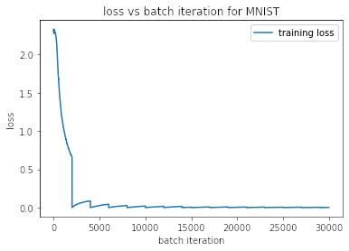

# CNN Digit Classifier

This repo contains a convolutional neural network which classifies the MNIST handwritten digits dataset.

My network contains a fairly simple architecture:

convolutional layer -> max pool -> convolutional layer -> max pool -> fully-connected layer

Despite this simple architecture, it still achieves over 98% accuracy on this 10-class task on the test set.
